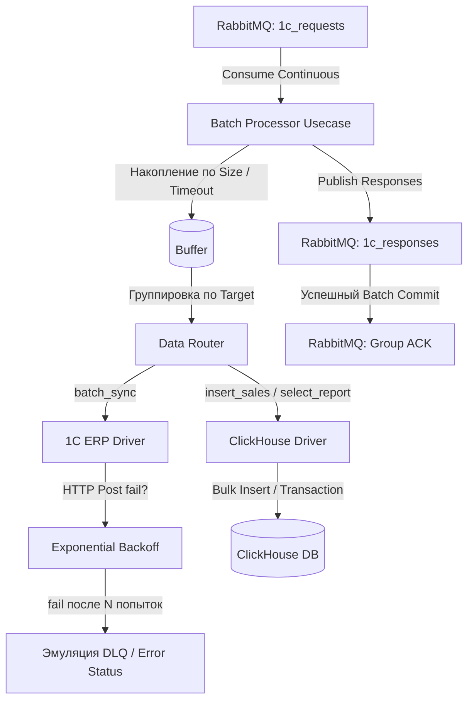

# Highload universal 1C Broker 

Асинхронный отказоустойчивый брокер данных на Go, спроектированный по канонам **Clean Architecture**. Служит связующим звеном (middleware) между очередями сообщений и внешними системами (ClickHouse, 1C), обрабатывая потоки данных в режиме высокой нагрузки (Highload) с гарантией сохранности сообщений.

## Ключевые архитектурные решения 

Проект демонстрирует понимание и практическое применение паттернов enterprise-разработки и оптимизации под нагрузку:

1. **Паттерн Батчинга (Batch Processor Usecase)**: Вместо выполнения тысяч одиночных запросов к БД и API, сообщения аккумулируются в батчи по двум критериям: достижение лимита `BATCH_SIZE` или истечение тайм-аута `BATCH_TIMEOUT_MS`. Это минимизирует накладные расходы на сеть и транзакции.
2. **Умный Роутинг (Data Router)**: Батч динамически группируется по целевым системам (`Target`) и операциям (`Action`), после чего распределяется по специализированным драйверам.
3. **Паттерн Резилентности: Exponential Backoff (1C)**: Интеграция с 1C снабжена механизмом повторных попыток с экспоненциальной задержкой. При недоступности сервиса батч не теряется, а плавно переводится в DLQ.
4. **Надежность Очередей (Manual Ack)**: Выключен `auto-ack` в RabbitMQ. Сообщения подтверждаются групповым коммитом (`Ack(lastDeliveryTag, true)`) только после успешной обработки или сохранения в DLQ, исключая потерю данных при падении воркера.
5. **Идиоматичный Go и Тестирование**: Реализовано 100% покрытие бизнес-логики юнит-тестами с изоляцией через заглушки (`Stubs`) и использованием продвинутого дифференциального сравнения структур через `github.com/google/go-cmp/cmp`.

---

## Архитектура системы

Проект разделен на независимые слои согласно принципам чистой архитектуры:

├── cmd/│   
│ └── broker/main.go       # Точка входа, DI и Graceful Shutdown

├── internal/   
│ ├── domain/              # Чистые сущности, DTO и интерфейсы (Инверсия зависимостей)  
│ ├── usecase/             # Оркестрация батчей и бизнес-логика обработки

│ └── infrastructure/      # Реализация драйверов внешних систем

### Схема движения данных (Data Flow)



---

## ⚡ Механизмы работы с Highload и 1С

### 1. ClickHouse Bulk Inserts & Reports
* **Пакетная вставка**: Драйвер ClickHouse открывает транзакцию и подготавливает стейтмент (`PrepareContext`) для массовой вставки продаж (`sales`) и остатков (`stocks`), предотвращая деградацию производительности СУБД.
* **Аналитический отчет (Turnover Report)**: Реализован сложный сырой SQL-запрос с использованием `ANY LEFT JOIN` и оптимизированной выборкой актуальных остатков (`LIMIT 1 BY`) для расчета оборачиваемости товаров (`days_left`).

### 2. Стратегия взаимодействия с 1С 
1C — традиционно тяжелая и медленная система для частых синхронных запросов. Брокер решает эту проблему:
* **Асинхронность**: Клиентские приложения пишут в RabbitMQ, не дожидаясь ответа от 1С.
* **HTTP Батчинг**: Драйвер упаковывает сгруппированные сообщения в один компактный JSON-массив и отправляет его на HTTP-сервис 1С за один системный вызов.
* **Плавный Failover**: При сбое сети или ошибках `5xx` на стороне 1С, воркер ждет $2^{attempt}$ секунд до следующей попытки. Если 1С "легла" окончательно, батч маркируется статусом `ERROR_DLQ`, отправляется в очередь ответов и подтверждается в RabbitMQ, чтобы не блокировать поток.

### 3. Graceful Shutdown (Безопасная остановка)
При получении сигналов `SIGINT` / `SIGTERM` воркер корректно завершает работу:
1. Прекращается прием новых сообщений из RabbitMQ.
2. Текущий буфер сообщений принудительно обрабатывается и сбрасывается в целевые системы.
3. Закрываются соединения с базами данных и брокером сообщений.

---

## Стек технологий

* **Язык**: Go (Идиоматичный подход, явное управление контекстами `context.Context`, строгая типизация).
* **Брокер**: RabbitMQ (с ручным управлением QoS prefetch и подтверждениями).
* **СУБД**: ClickHouse (движок `MergeTree`, транзакционные батчи).
* **Протоколы**: HTTP/REST (взаимодействие с 1С с поддержкой отказоустойчивости).
* **Логирование**: Нативный структурированный логгер `log/slog`.

---

## 🧪 Тестирование

Тесты написаны в соответствии с лучшими практиками экосистемы Go:
* Использование табличных тестов (`Table-driven tests`).
* Использование библиотеки `go-cmp` для генерации читаемых диффов при несовпадении сложных структур (вместо громоздких циклов).
* Изоляция логики через интерфейсные стабы (`dataRouterStub`, `queueMessageBrokerStub`).

Запуск тестов:
```bash
go test -v ./internal/usecase/...
```
